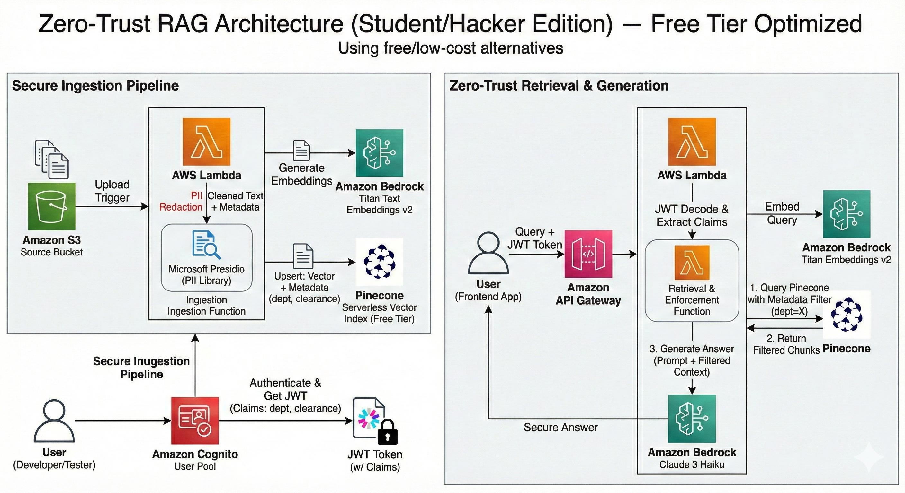

# Secure Serverless RAG Pipeline API


> **A scalable, serverless backend for Retrieval-Augmented Generation (RAG) applications, engineered on AWS Lambda and API Gateway.**

---

## 📖 Table of Contents
- [Architecture](#-architecture)
- [Project Overview](#-project-overview)
- [Key Features](#-key-features)
- [Tech Stack](#-tech-stack)
- [Repository Structure](#-repository-structure)
- [Setup & Deployment](#-setup--deployment)
- [API Usage](#-api-usage)

---

## 🏗 Architecture



The architecture follows a fully serverless pattern:
1.  **API Gateway** acts as the secure entry point, handling request validation and throttling.
2.  **AWS Lambda** executes the custom inference logic, orchestrating calls between the LLM and the vector store.
3.  **Vector Store** (e.g., Pinecone/FAISS) retrieves semantically relevant context based on user queries.
4.  **IAM & Systems Manager** ensure secure access control and secret management without hardcoding credentials.

---

## 📌 Project Overview
This project implements a production-ready **Retrieval-Augmented Generation (RAG)** backend. It is designed to decouple complex inference logic from client-side applications, providing a secure, high-throughput API for querying custom knowledge bases.

Unlike monolithic implementations, this solution utilizes **AWS Lambda** to handle variable traffic loads with zero idle server costs, making it highly cost-effective for on-demand AI tasks.

---

## 🚀 Key Features

* **Serverless Scalability:** Built on **AWS Lambda**, allowing the application to scale automatically from zero to thousands of concurrent requests without manual intervention.
* **Custom Inference Engine:** Developed a Python-based orchestration layer (using `boto3`) to manage the interaction between Large Language Models (LLMs) and vector embeddings, optimizing for latency and cost.
* **Enterprise-Grade Security:**
    * **IAM Policies:** Granular permission scopes following the Principle of Least Privilege.
    * **Secret Management:** API keys and credentials are securely fetched from **AWS Systems Manager (SSM) Parameter Store** at runtime.
    * **Network Security:** Strict CORS configuration and SSL/TLS encryption via API Gateway.
* **Automated Data Pipeline:** Includes logic for ingesting unstructured text data, generating embeddings, and indexing them for efficient semantic search.

---

## 🛠 Tech Stack

| Category | Technology |
|----------|------------|
| **Cloud Provider** | AWS (US-East-1) |
| **Compute** | AWS Lambda (Python 3.9 Runtime) |
| **API Management** | Amazon API Gateway (REST API) |
| **Security** | AWS IAM, AWS SSM Parameter Store |
| **SDKs & Libs** | Python 3.x, Boto3, Requests, JSON |
| **Architecture** | Serverless, Event-Driven, RESTful |

---

## 📂 Repository Structure

```bash
secure-serverless-rag-api/
│
├── src/
│   ├── lambda_function.py     # Main entry point for API requests
│   ├── utils.py               # Helper functions for formatting and validation
│   └── vector_search.py       # Logic for querying the vector database
│
├── docs/
│   └── architecture_diagram.png  # System architecture reference
│
├── tests/
│   └── test_api.py            # Unit tests for the Lambda handler
│
├── .gitignore                 # Security exclusions (secrets, env vars)
├── requirements.txt           # Python dependencies
└── README.md                  # Project documentation
